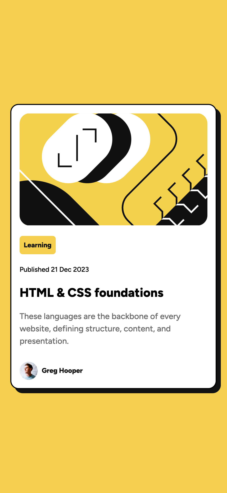
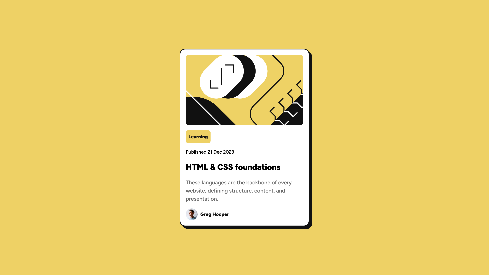

## Table of contents

- [Overview](#overview)
  - [The challenge](#the-challenge)
  - [Screenshot](#screenshot)
  - [Links](#links)
  - [Built with](#built-with)
  - [What I learned](#what-i-learned)
  - [Continued development](#continued-development)
- [Author](#author)

### The challenge

Users should be able to:
- View the blog preview card on different screen sizes
- See hover and focus states for all interactive elements on the page

### Screenshot



### Links
- Solution URL: [GitHub repository](https://github.com/megamemma/sandbox/tree/main/blog-preview-card)
- Live Site URL: [Live demo](https://blog-preview-card-ten-umber.vercel.app/)

### Built with
- Semantic HTML5 markup
- CSS custom properties
- Flexbox, Grid
- Responsive design

### What I learned
- Used flexbox for one-dimensional layout (vertical arrangement inside the card), instead of complicating with grid.

```css
.card {
  display: flex; 
  flex-direction: column; 
  gap: 1.25rem;
}
```

- Separated typography into reusable text-preset-* classes, combined with CSS custom properties for easier reuse + consistency.

```html
<h1 class="article-head text-preset-1">HTML & CSS foundations</h1>
```

```css
.text-preset-1 {
  font-size: 1.5rem;
  font-weight: 800;
}
```

- Using spacing variables instead of arbitrary values => Cleaner, easier to adjust.

```css 
:root { --spacing-100: 0.5rem; --spacing-300: 1.5rem; } 
.author-info { gap: var(--spacing-100); }
```
- Be more deliberate with units: rem works well for typography/spacing, but fixed dimensions can be more appropriate for pfp imgs, which should not scale too much with the user's font-size settings.
- Avoid approximating values, stick to design tokens (colors: gray-950 instead of black).
```css
:root { --gray-950: hsl(0, 0%, 7%); }
```

- Exclude unused font sizes and styles while importing.
```html
<link href="https://fonts.googleapis.com/css2?family=Figtree:wght@500;800&display=swap" rel="stylesheet" >
```

### Continued development
For future projects, I want to:

- Improve responsive behavior and learn when @media queries are actually necessary vs letting the layout adapt naturally.
- Learn to use breakpoints.
- Get more comfortable with responsive units and fluid sizing.
- Learn to use accessibility tools (Lighthouse, contrast checkers etc.) without assuming the design tokens are accessible a priori.

## Author
- Github - [@megamemma](https://www.github.com/megamemma)