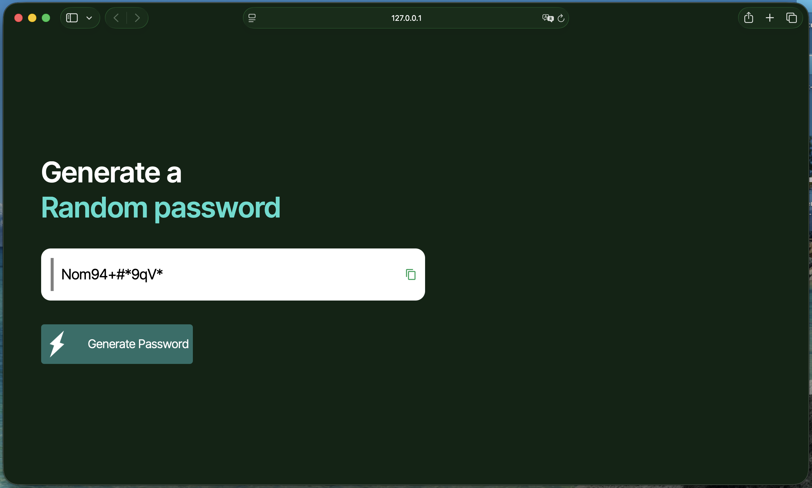

## Screenshots 

## Features 
- Generates random password with guaranteed uppercase, lowercase, numbers and symbols included.
- Copy to clipboard via Clipboard API
- Shuffled output (no fixed category order)

## Possible improvements 
- Add configurable options: adjustable length slider, toggle upper-/lowercase/nums/syms ON/OFF. 
- Add other "symbols" modes (checkboxes): toggling for conservative symbol subsets (!@#$%^&*) for sites & forms with strict, legacy char pools.
