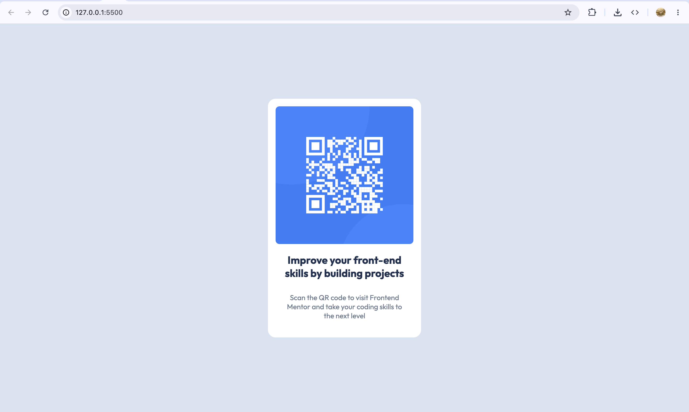

# Frontend Mentor - QR code component solution

This is a solution to the [QR code component challenge on Frontend Mentor](https://www.frontendmentor.io/challenges/qr-code-component-iux_sIO_H). 

### Screenshot


### Links
- Solution URL: [GitHub Repository](https://github.com/megamemma/sandbox/tree/main/qr-code)
- Live Site URL: [Vercel Deployment](https://qr-code-og26m2pbk-megamemma1.vercel.app/)

### Built with
- Semantic HTML5 markup
- CSS custom properties
- CSS Grid
- Mobile-first workflow

### What I learned
Centering the card effortlessly using CSS Grid on the body:

```css
body {
  min-height: 100vh;
  display: grid;
  place-content: center;
}
```

### Continued development
**Fluid Typography:** Want to use `clamp()` functions to handle smooth font scaling between mobile and desktop without rigid breakpoints.
- **CSS Architecture:** Deepen understanding of CSS naming methodologies (BEM, SMACSS etc.) for scalable styles as projects grow.

## Author
- Github - [@megamemma](https://github.com/megamemma)