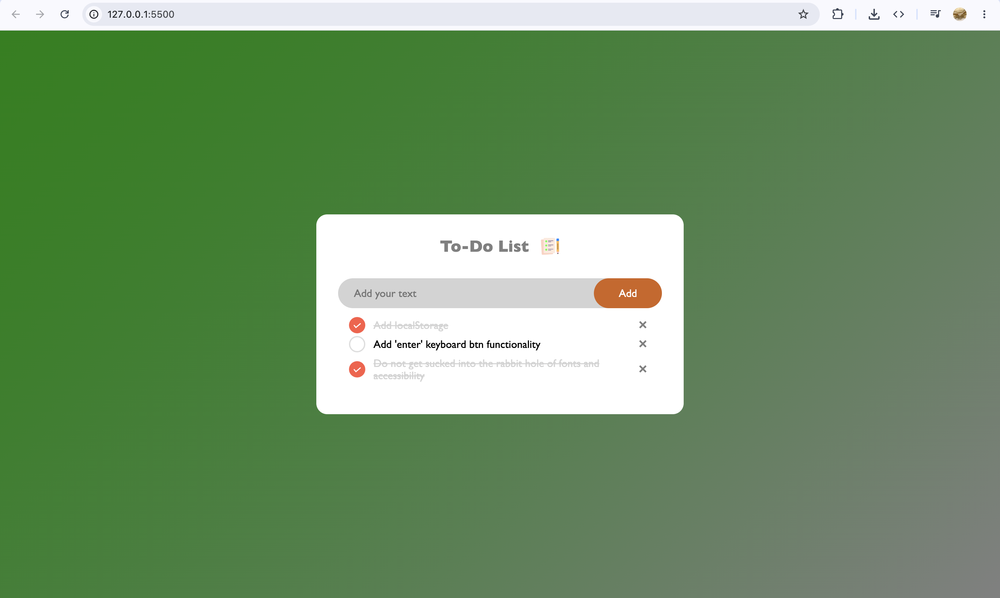

## Screenshots 

## Features 
- Add, check off and delete tasks
- Tasks persist across reloads, via localStorage
- Empty and whitespace-only input gets rejected
- Task text inserted with `textContent` no innerHTML insertion

## Possible improvements 
- Replace `alert()` with a toast notification
- Add a task with the Enter key (currently click-only)
- Editing existing tasks
- Filter: all / active / done
- "Clear completed" button 
- Keyboard accessibility: tasks are clickable `li`s, so they can't be focused/toggled without a mouse (real checkboxes or `role = "checkbox"` + `tabindex`)